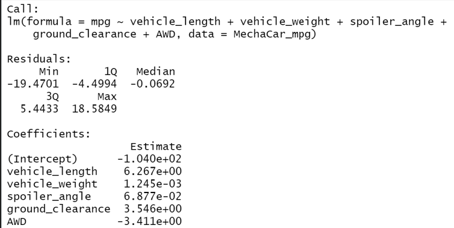
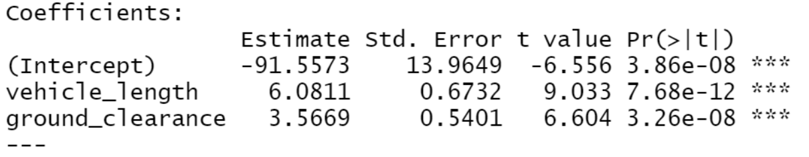
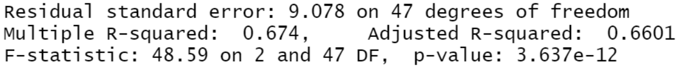
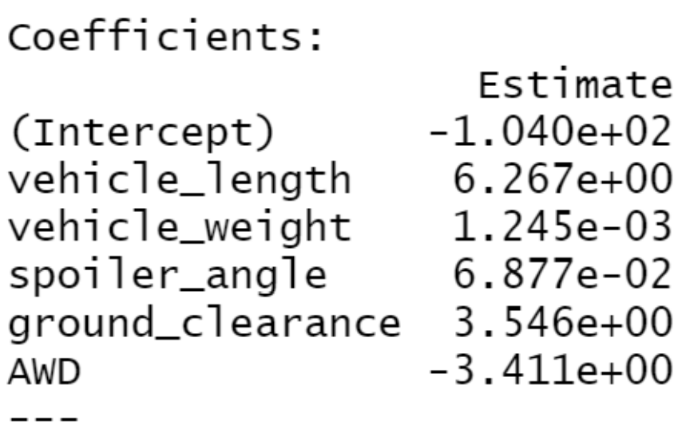
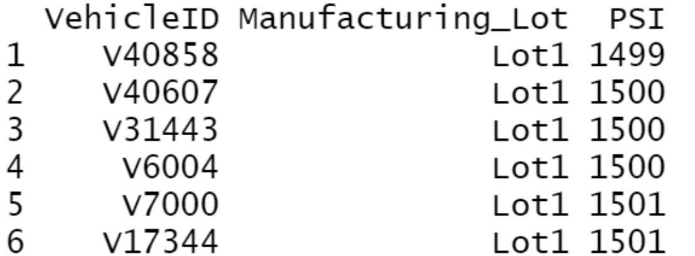
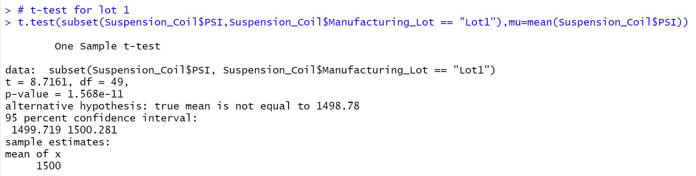
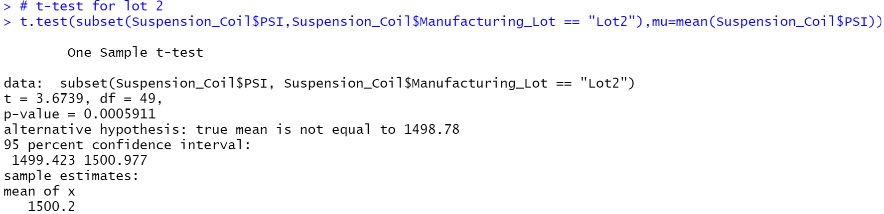
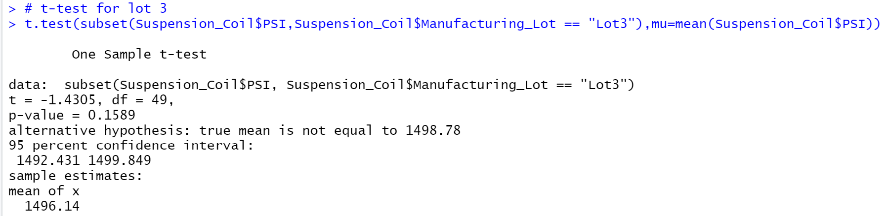

# MechaCar_Statistical_Analysis

# Objective
Linear regressions are made to analyze and identify which dataset predict the miles per gallon of an automotive dataset.

# Linear Regression MPG Prediction

## Model 1:

summary(lm(mpg ~ vehicle_length + vehicle_weight + spoiler_angle + ground_clearance + AWD, data=mecha_mpg))

The correlation amongst these variables is (71.5%). All of the variables checked against mpg, ground clearance, and vehicle length, are all statistically significant (2.6x10-12 and 5.2x10-8). 

## Model 2:

summary(lm(mpg ~ vehicle_length + ground_clearance, data=mecha_mpg))

The correlation amongst these variables is (67.4%). In running the linear regression on just the vehicle length and the ground clearance, vehicle length became less statistically significant (7.7x10-12 ) and ground clearance became more statistically significant (3.3x10-8). 

## Zero/ Non-Zero Slopes

ALL Non-Zero resulting slopes within each variable used in the linear model 

## Linear Regression Effectiveness

The vehicle length and ground clearance, have a great effect on the mpg, which is predicted by the model. Indications of other unlisted variables may be affecting mpg, but correlation is high.

## Suspension Coil Statistic

Lot 1 and Lot 2 are the only lots within the design Specifications ("the variance of the suspension coils are not to exceed 100 pounds per square inch") however, Lot 3 is off by 170% (Lot 3 Variance = 170PSI). Therefore, design specificatins are not met for all manufacturing lots. 

## Suspension Coil T - Test Results

Null hypothesis are seen across the board with the lot cases, thus failing to reject. The ifferences between lots one and two are negligible. P-values are greater the 0.05. While lot three has a P-value of .04. Lot three's results indicates it is outside the population mean and is statistically significant.

## Study Design: MechaCar vs Competition

### Overview

Means or several metrics can be compared using data on MechaCar's competition.

### Metrics Used in Tests

Engine size, ground clearance, vehicle weight, engine life span, vehicle length, and vehicle hp.

### Null or Alternative Hypothesis

If ompetitors P-value is above 0.05 then there is no statistical correlation, but if the metrics P-value is below 0.05, then there is a statistical correlation.

### Tests for Results

Multiple sampled test

### Required Data

CSV.'s containing vehicle length, weight, ground clearance, and engine lifespan, horsepower and size. All data should have equal amount of data.
